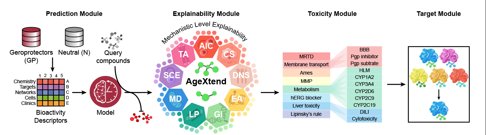

# AgeXtend

### Introduction
 <br>
<div align="center">
</div>
<br>

**AgeXtend** is a multimodal, bioactivity-based, and mechanism-backed Explainable AI Predictor for geroprotectors. AgeXtend supports 2 distinct work packages: Predictor and Browser.
The first work package, **Predictor**, involves a bioactivity-based classifier (**Geroprediction** module) for predicting geroprotective compounds, coupled with an **Explainability** module providing mechanistic insights into biological processes behind the predictions, a **Toxicity** module to evaluate their toxicity in the biological context, and finally, a **Target** module that suggests protein targets of the putative geroprotective compounds.
The second work package, **Browser**, allows users to explore through the 20 pre-screened databases specifically curated for these functionalities.

## License Key

**AgeXtend is free for academic institutions, however, for commercial utilization a commercial license key is required. Users (academic/commercial) may apply for a valid "License Key" [here](https://forms.gle/y1sCpSGEAML8XWGGA).**

You can also generate your own predictions using AgeXtend’s [Colab notebook](https://colab.research.google.com/drive/1yS70GuI4H29KICQlLDQHLDk3nyULWJ94)

## Environment Setup (done using requirement.txt)

**Major dependencies**
1. [Signaturizer (v1.1.11)](https://gitlabsbnb.irbbarcelona.org/packages/signaturizer)
2. [RDKit (v2022.3.1)](https://www.rdkit.org/)

**Minor dependencies**
1. os
2. [scikit-learn (v1.2.1)](https://scikit-learn.org/stable/whats_new/v1.0.html)
3. [xgboost (v1.5.1)](https://github.com/dmlc/xgboost)
4. [pandas (v1.4.3)](https://pandas.pydata.org/)
5. [numpy (v>=1.20.3)](https://numpy.org)
6. [tqdm](https://tqdm.github.io)
7. [joblib (v1.1.1)](https://pypi.org/project/joblib/)
8. [matplotlib (v>=3.2.2)](https://pypi.org/project/matplotlib/)
9. [seaborn (v0.11.2)](https://seaborn.pydata.org/)
10. [importlib ](https://pypi.org/project/importlib/)
11. [importlib-resources (v5.7.1)](https://github.com/python/importlib_resources)


**Quick setup**

The file [requirement.txt](https://github.com/the-ahuja-lab/AgeXtend/blob/main/env/requirement.txt) will be used for the environment setup and by running the following command.
```
$ pip install -r requirement.txt
```


## How to use AgeXtend?

### Installation using pip 
```
$ pip install -i https://test.pypi.org/simple/AgeXtend
```

### License activation (One time)
To apply for the license [click here](https://forms.gle/y1sCpSGEAML8XWGGA)

```
>>> from AgeXtend import Predictor 
```
Activate AgeXtend license
```
>>> Predictor.license('license key') #Example: Predictor.license('KKKVFZ41111WF6RTQ')
```

## Work Packages
AgeXtend supports 2 distinct work packages:<br/>
1. Predictor
2. Browser

### Predictor

#### Geroprediction and Explainability Modules ####

Predicts the anti-aging potential for the input SMILES:<br/>
```
>>> from AgeXtend import Predictor
```
Prepare a list of canonical SMILES (Open Babel generated) strings
```
>>> smiles = ['ClCC=C', 'C=CCOC(=O)CC(C)C'] 
```
Create an AgeXtend type object to featurize the query compounds (i.e. list of canonical SMILES)
```
>>> agex_obj = Predictor.featurize(smiles)
```
Use the AgeXtend object for predictions
```
>>> output = Predictor.predict(agex_obj)
```
Get the list of resulting data frames that are part of the rest of the modules
```
>>> output.keys()
dict_keys(['Anti_Aging_Prediction', 'Explainability_Status', 'Explainability_Probabilities'])
```
**Note:** Explainability_Probabilities will be empty by default unless selected otherwise by supplying additional arguments.

Get the result of a specific output data frame
```
>>> output['Explainability_Status']
```
#### Sub Explainability and Target Module ####

##### Additional arguments:
**AgeXtend** also supports the following modules along with the Prediction and Explainability modules, which can be chosen using the boolean option (True)

| Parameter Name | Description | Type | Default value | **Output (If True)** |
| -------- | -------- | -------- | -------- | -------- |
| probs | Probabilities of Explainability and/or Toxicity Module | boolean  | False | Explainability_Probabilities / Explainability_Toxicity_Probabilities |
| HC | Run Toxicity Module (Health Check) | boolean  | False | Explainability_Toxicity_Status |
| TS | Sub Explainability Level Tanimoto Similarity Test | boolean  | False | Explainability_response |
| BDL | BindingDB Target Information and Druggability (Lipinski Rule) | boolean  | False | Druggability_and_Potential_Targets |


**Example**
```
>>> output = Predictor.predict(agex_obj, TS=True)
>>> output.keys()
dict_keys(['Anti_Aging_Prediction', 'Explainability_Status', 'Explainability_Probabilities', 'Explainability_response'])
>>> output = Predictor.predict(agex_obj, HC=True, BDL=True)
>>> output.keys()
dict_keys(['Anti_Aging_Prediction', 'Explainability_Toxicity_Status', 'Explainability_Toxicity_Probabilities', 'Druggability_and_Potential_Targets'])
```

####  Efficient Bulk Prediction / Custom AgeXtend Database
Predictor module also provides functionalities for efficient bulk data prediction
```
>>> Predictor.bulk_predict(input=smiles_list) 
```
Or user can also use pre-calculated AgeXtend type object as input
```
>>> agex_obj = Predictor.featurize(smiles_list)
>>> Predictor.bulk_predict(input=agex_obj)
```

##### Additional arguments:

| Parameter Name | Description | Type | Default value |
| -------- | -------- | -------- | -------- |
| outfolder | Output Database type folder name | string | AgeXtendDB |
| chunksize | Number of predictions input per iteration for faster job completion | Integer | 10000 |

**Note**
The output folder of Bulk prediction function can be used as a Custom database for input in AgeXtend Browser module


### Browser

To explore the AgeXtend pre-complied predictions of various databases:<br/>
```
>>> from AgeXtend import Browser
```
Use Open Babel to Generate Canonical SMILES format of the query compound as input
```
>>> Browser.search(query='OC(=O)CCCc1c[nH]c2c1cccc2', output='/path/to/output/folder/')
```

Unzip the **AgeXtendBrowserOut.zip** file to visualize/print the generated report (HTML format)

**Note:** the **report file** (AgeXtend_BrowserOut.html) must be in the same folder with the **images** folder


#### Additional arguments:
**AgeXtend** also supports the use of locally complied Predictor module outputs (Folder containing CSV format outputs)

| Parameter Name | Description | Default Database |
| -------- | -------- | -------- |
| path | Path to the AgeXtend pre-complied prediction database | gutMGene |

**Example**
```
>>> Browser.search(path='/path/to/Database/Folder/', query='OC(=O)CCCc1c[nH]c2c1cccc2', output='/path/to/output/folder/')
```

### Pre-complied AgeXtend Prediction Databases
| DB Name | DB version | FTP size | FTP link |
| -------- | -------- | -------- | -------- |
| FooDB | Pre-release 1.0 | 63M | [http://agextend.ahujalab.iiitd.edu.in:8080/FOODB/](http://agextend.ahujalab.iiitd.edu.in:8080/FOODB/) |
| HMDB | v5.0 | 231M | [http://agextend.ahujalab.iiitd.edu.in:8080/HMDB/](http://agextend.ahujalab.iiitd.edu.in:8080/HMDB/) |
| IMPPAT | v2.0 | 4K | [http://agextend.ahujalab.iiitd.edu.in:8080/IMPPAT/](http://agextend.ahujalab.iiitd.edu.in:8080/IMPPAT/) |
| AfroDb | - | 756K | [http://agextend.ahujalab.iiitd.edu.in:8080/AfroDB/](http://agextend.ahujalab.iiitd.edu.in:8080/AfroDB/) |
| AgingAtlas | v1.0 | 748K | [http://agextend.ahujalab.iiitd.edu.in:8080/AgingAtlas/](http://agextend.ahujalab.iiitd.edu.in:8080/AgingAtlas/) |
| ChemBridge | - | 788K | [http://agextend.ahujalab.iiitd.edu.in:8080/Chembridge/](http://agextend.ahujalab.iiitd.edu.in:8080/Chembridge/) |
| ChemDiv BBlocks | - | 39M | [http://agextend.ahujalab.iiitd.edu.in:8080/ChemdivBBlocks/](http://agextend.ahujalab.iiitd.edu.in:8080/ChemdivBBlocks/) |
| CMNPD | v1.0 | 20M | [http://agextend.ahujalab.iiitd.edu.in:8080/CMNPD/](http://agextend.ahujalab.iiitd.edu.in:8080/CMNPD/) |
| DDPEDB | - | 4K | [http://agextend.ahujalab.iiitd.edu.in:8080/DDPD/](http://agextend.ahujalab.iiitd.edu.in:8080/DDPD/) |
| ECMDB | v2.0 | 4K | [http://agextend.ahujalab.iiitd.edu.in:8080/ECMDB/](http://agextend.ahujalab.iiitd.edu.in:8080/ECMDB/) |
| RepoHub | release-3/24/2020 | 3.9M | [http://agextend.ahujalab.iiitd.edu.in:8080/RepoHub/](http://agextend.ahujalab.iiitd.edu.in:8080/RepoHub/) |

